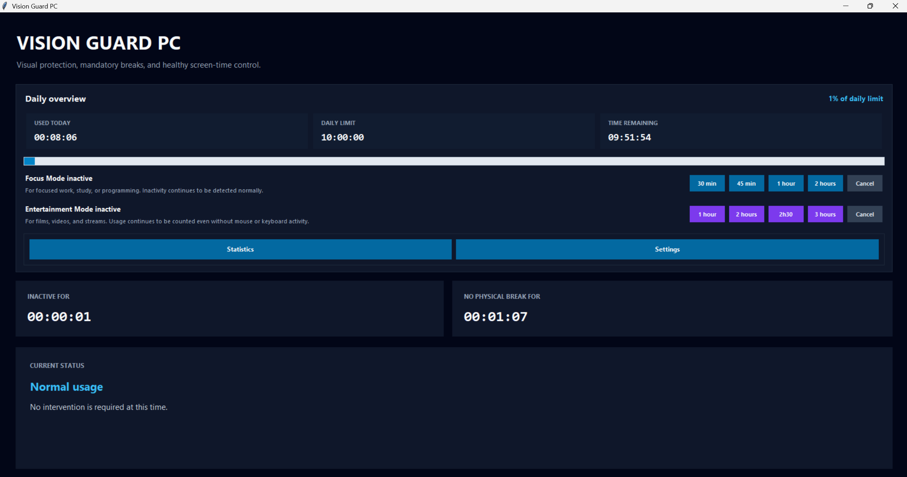

# Vision Guard PC

### A desktop wellness assistant for healthier and more conscious computer use

**English** · [Português](README.pt.md)

 

**Windows 10/11** · macOS planned · Linux planned

---

## Download for Windows

### [Download Vision Guard PC v1.0.0](https://github.com/MauricioMoraisZage/vision-guard-pc/releases/latest/download/VisionGuardPC-1.0.0-Windows-x64.exe)

Vision Guard PC is currently available as a portable application for Windows 10 and Windows 11.

1. Download the `.exe` using the link above.
2. Run the downloaded executable.
3. No installation or Python environment is required.

> **Important:** Do not use **Code → Download ZIP** or `git clone` to install Vision Guard PC. This public repository contains the product documentation. The ready-to-use Windows application is available through **GitHub Releases**.

You can also visit the [latest release page](https://github.com/MauricioMoraisZage/vision-guard-pc/releases/latest) to view the release notes and download the optional SHA-256 checksum.

---

## About Vision Guard PC

**Vision Guard PC** is a desktop wellness application designed to help people build healthier habits while using a computer.

It monitors active screen time, detects inactivity, schedules visual and physical breaks, provides blink reminders, and helps users respect daily and nighttime usage limits.

The application is especially useful for people who spend long periods:

* working;
* studying;
* programming;
* gaming;
* watching films or videos;
* consuming digital content.

Vision Guard PC follows a local-first approach. User settings and usage information remain stored on the user's computer.

> Vision Guard PC is a wellness and productivity tool. It is not a medical device and does not replace professional medical advice.

---

## Release status

| Platform        | Status                         |
| --------------- | ------------------------------ |
| Windows 10 | Available — v1.0.2 |
| Windows 11 | Available — v1.0.2 |
| macOS           | Planned                        |
| Linux           | Planned                        |
| Microsoft Store | Planned                        |

Vision Guard PC v1.0.2 is available for Windows 10 and Windows 11.

The first stable release will focus on Windows.

Official downloads will be published through the [GitHub Releases](../../releases) section of this repository.

---

## Main features

* Active and inactive computer-use tracking
* Configurable blink reminders
* Visual break reminders
* Physical break reminders
* Daily computer-use limit
* Nighttime usage lock
* Focus Mode
* Entertainment Mode
* Usage statistics
* Portuguese and English interface
* Persistent user settings
* Responsive desktop interface
* Automatic window size and position restoration
* System tray integration
* Optional startup with Windows
* Local SQLite data storage
* Protection against multiple application instances

---

## Focus Mode

Focus Mode is designed for concentrated work, study, and programming sessions.

Available durations:

* 30 minutes
* 45 minutes
* 1 hour
* 2 hours

During Focus Mode, regular interruptions are temporarily reduced while inactivity detection continues to work normally.

---

## Entertainment Mode

Entertainment Mode is designed for films, videos, streams, and other activities that may not require constant keyboard or mouse interaction.

Available durations:

* 1 hour
* 2 hours
* 2 hours and 30 minutes
* 3 hours

During Entertainment Mode:

* usage continues to be counted without keyboard or mouse interaction;
* blocking visual and physical breaks are temporarily suspended;
* wellness notifications appear during long sessions;
* the daily usage limit remains active;
* the nighttime lock remains active.

Focus Mode and Entertainment Mode cannot be active at the same time.

---

## Default wellness profile

All values can be changed from the Settings window.

| Setting                 | Default value |
| ----------------------- | ------------: |
| Blink reminder          |     5 minutes |
| Visual break interval   |    20 minutes |
| Visual break duration   |    20 seconds |
| Physical break interval |    50 minutes |
| Physical break duration |    10 minutes |
| Daily usage limit       |      10 hours |
| Inactivity threshold    |    10 minutes |
| Night lock starts       |         22:30 |
| Night lock ends         |         07:30 |

These values are general product defaults and must not be interpreted as medical recommendations.

---

## Interface

Vision Guard PC includes:

* a responsive main dashboard;
* daily active-usage progress;
* daily-limit information;
* inactivity status;
* continuous time without a physical break;
* Focus Mode controls;
* Entertainment Mode controls;
* configurable settings;
* usage statistics;
* visual and physical break screens;
* nighttime and daily-limit lock screens.

On the first execution, the main window opens centered with a comfortable default size.

The application remembers:

* window size;
* window position;
* maximized state;
* selected language;
* wellness settings.

Statistics and Settings open using the same size and state as the main application window.

---

## Screenshots

### Main dashboard

  

### Focus Mode and Entertainment Mode

<table>
  <tr>
    <td width="50%">
      
    </td>
    <td width="50%">
      
    </td>
  </tr>
  <tr>
    <td align="center"><strong>Focus Mode</strong></td>
    <td align="center"><strong>Entertainment Mode</strong></td>
  </tr>
</table>

### Settings and usage statistics

<table>
  <tr>
    <td width="50%">
      
    </td>
    <td width="50%">
      
    </td>
  </tr>
  <tr>
    <td align="center"><strong>Customisable settings</strong></td>
    <td align="center"><strong>Usage statistics</strong></td>
  </tr>
</table>

### Visual and physical breaks

<table>
  <tr>
    <td width="50%">
      
    </td>
    <td width="50%">
      
    </td>
  </tr>
  <tr>
    <td align="center"><strong>Visual break</strong></td>
    <td align="center"><strong>Physical break</strong></td>
  </tr>
</table>

## Download and run

Vision Guard PC v1.0.2 is distributed as a portable Windows application. It does not require installation.

1. Open the [latest official release](https://github.com/MauricioMoraisZage/vision-guard-pc/releases/latest).
2. Download `VisionGuardPC-1.0.2-Windows-x64.exe`.
3. Optionally download the `.sha256` file to verify its integrity.
4. Run the executable.

> Microsoft Defender SmartScreen may display an uncommon-download warning because this first release is new and is not yet digitally signed. Download Vision Guard PC only from this official repository.

## Privacy

Vision Guard PC was designed with a local-first approach.

The application does not need to send usage information to an external server. Usage history and settings remain stored locally on the user's computer.

Vision Guard PC does not monitor:

* text typed by the user;
* visited websites;
* document contents;
* passwords;
* private messages;
* browser history.

The application only uses the information required to measure computer interaction and manage the configured wellness routines.

A complete privacy policy will be available in `PRIVACY.md`.

---

## Downloads

Vision Guard PC v1.0.2 for Windows is now available through the official GitHub Releases page.

When available, downloads will be published through:

1. GitHub Releases;
2. Microsoft Store.

Do not download Vision Guard PC from unofficial websites or third-party mirrors.

---

## Platform roadmap

### Windows

Windows 10 and Windows 11 are the primary platforms for the first stable release.

### macOS

macOS support is planned. It will require dedicated implementations for:

* system inactivity detection;
* startup integration;
* system tray behaviour;
* application packaging;
* platform-specific system controls.

### Linux

Linux support is also planned. Different desktop environments and display servers will require additional validation and platform-specific integrations.

No macOS or Linux build will be published before being tested on the corresponding operating system.

---

## Public repository scope

This is the official public repository for Vision Guard PC.

It is used for:

* product documentation;
* screenshots;
* release notes;
* downloadable application packages;
* privacy and security information;
* issue reporting;
* public announcements.

The application source code is maintained in a separate private repository.

---

## Author

**Maurício Morais Zage**
Computer Engineer
Luanda, Angola

GitHub: [MauricioMoraisZage](https://github.com/MauricioMoraisZage)

Vision Guard PC was designed, developed, tested, and maintained by Maurício Morais Zage.

Artificial intelligence tools were used as development assistants during planning, debugging, code review, testing support, interface improvement, and documentation.

Product decisions, validation, maintenance, distribution, and project authorship remain under the responsibility of the author.

---

## Copyright

Copyright © 2026 Maurício Morais Zage.

All rights reserved.

This repository does not grant permission to copy, redistribute, modify, reverse engineer, or commercially exploit Vision Guard PC unless explicitly authorized by the author.

A complete end-user licence agreement will be provided before the first public release.

---

## Disclaimer

Vision Guard PC provides general wellness reminders intended to encourage healthier computer-use habits.

It does not diagnose, prevent, or treat medical conditions.

People experiencing eye discomfort, pain, persistent headaches, vision changes, or other health concerns should consult a qualified healthcare professional.
