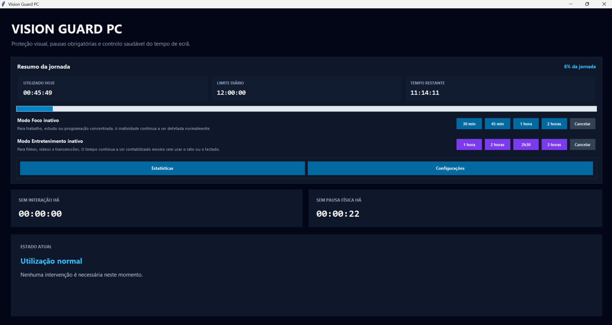
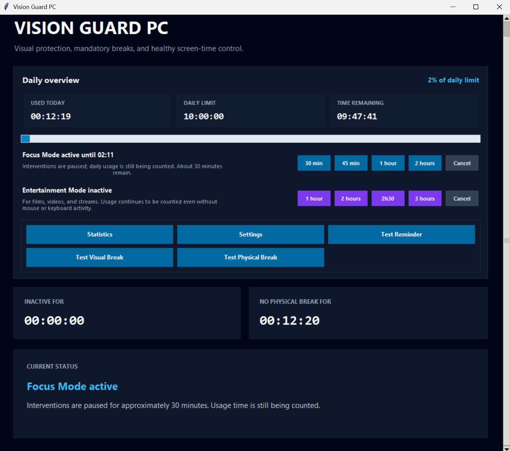
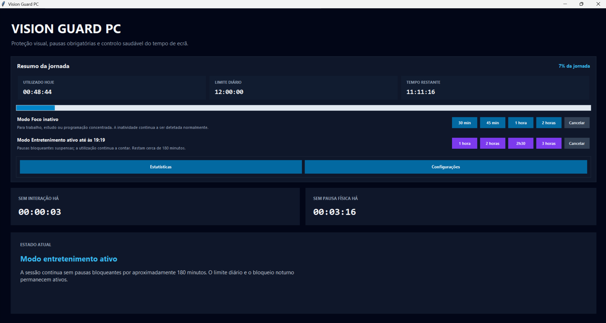
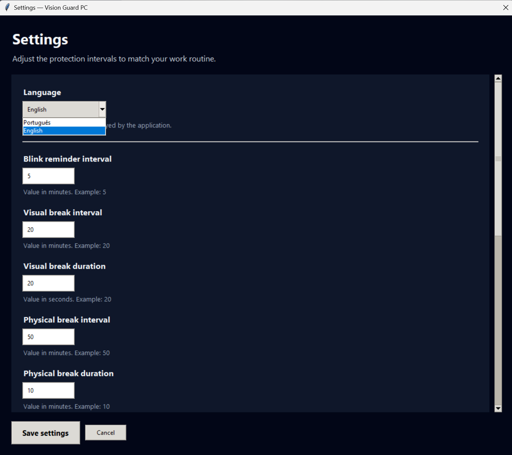
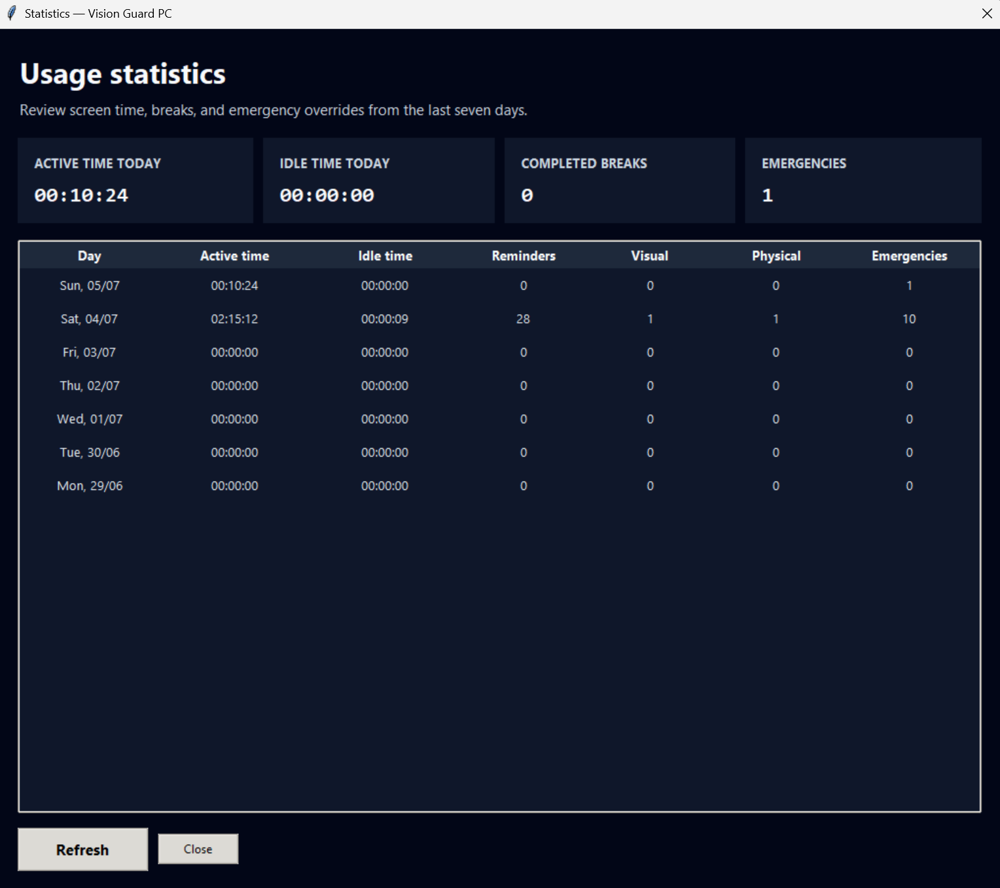
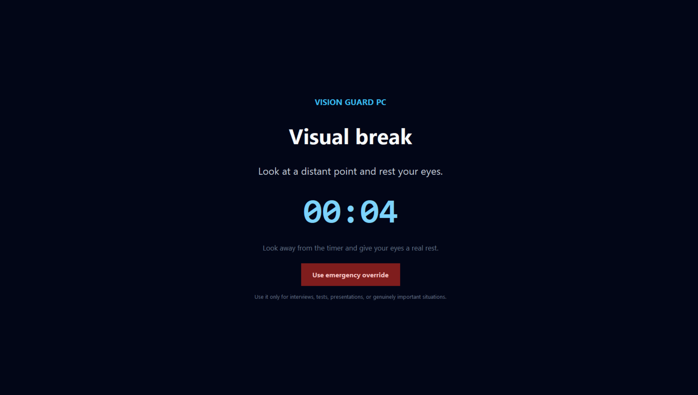
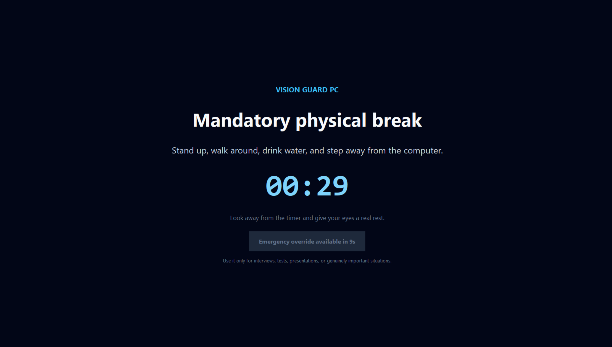

# Vision Guard PC

### Um assistente de bem-estar para uma utilização mais saudável e consciente do computador

[English](README.md) · **Português**

 

**Windows 10/11** · macOS planeado · Linux planeado

---

## Descarregar para Windows

### [Descarregar o Vision Guard PC v1.0.0](https://github.com/MauricioMoraisZage/vision-guard-pc/releases/latest/download/VisionGuardPC-1.0.0-Windows-x64.exe)

O Vision Guard PC está atualmente disponível como aplicação portátil para Windows 10 e Windows 11.

1. Descarregue o ficheiro `.exe` através do link acima.
2. Execute o ficheiro descarregado.
3. Não é necessário instalar o Python nem configurar um ambiente de desenvolvimento.

> **Importante:** Não utilize **Code → Download ZIP** nem `git clone` para instalar o Vision Guard PC. Este repositório público contém a documentação do produto. A aplicação pronta para utilização está disponível através do **GitHub Releases**.

Também pode abrir a [página da versão mais recente](https://github.com/MauricioMoraisZage/vision-guard-pc/releases/latest) para consultar as notas da versão e descarregar o checksum SHA-256 opcional.

---

## Sobre o Vision Guard PC

O **Vision Guard PC** é uma aplicação de bem-estar para desktop criada para ajudar as pessoas a desenvolver hábitos mais saudáveis durante a utilização do computador.

A aplicação acompanha o tempo de utilização ativa, identifica períodos de inatividade, organiza pausas visuais e físicas, apresenta lembretes para piscar os olhos e ajuda o utilizador a respeitar limites diários e horários noturnos.

O Vision Guard PC é especialmente útil para pessoas que passam longos períodos:

* a trabalhar;
* a estudar;
* a programar;
* a jogar;
* a assistir a filmes ou vídeos;
* a consumir conteúdos digitais.

A aplicação segue uma abordagem local. As configurações e os dados de utilização permanecem armazenados no computador do utilizador.

> O Vision Guard PC é uma ferramenta de bem-estar e produtividade. Não é um dispositivo médico e não substitui aconselhamento profissional.

---

## Estado do lançamento

| Plataforma      | Estado                                |
| --------------- | ------------------------------------- |
| Windows 10 | Disponível — v1.0.0 |
| Windows 11 | Disponível — v1.0.0 |
| macOS           | Planeado                              |
| Linux           | Planeado                              |
| Microsoft Store | Planeado                              |

O Vision Guard PC v1.0.0 está disponível para Windows 10 e Windows 11.

A primeira versão estável será direcionada ao Windows.

Os downloads oficiais serão publicados na secção [GitHub Releases](../../releases) deste repositório.

---

## Principais funcionalidades

* Contagem do tempo de utilização ativa e inativa
* Lembretes configuráveis para piscar os olhos
* Pausas visuais
* Pausas físicas
* Limite diário de utilização
* Bloqueio de utilização noturna
* Modo Foco
* Modo Entretenimento
* Estatísticas de utilização
* Interface em português e inglês
* Configurações persistentes
* Interface responsiva
* Restauração automática do tamanho e posição da janela
* Integração com a bandeja do sistema
* Inicialização opcional com o Windows
* Armazenamento local em SQLite
* Proteção contra múltiplas instâncias da aplicação

---

## Modo Foco

O Modo Foco foi criado para sessões concentradas de trabalho, estudo e programação.

Durações disponíveis:

* 30 minutos
* 45 minutos
* 1 hora
* 2 horas

Durante o Modo Foco, as interrupções normais são temporariamente reduzidas, enquanto a deteção de inatividade continua a funcionar normalmente.

---

## Modo Entretenimento

O Modo Entretenimento foi criado para filmes, vídeos, transmissões e outras atividades que podem não exigir interação constante com o rato ou teclado.

Durações disponíveis:

* 1 hora
* 2 horas
* 2 horas e 30 minutos
* 3 horas

Durante o Modo Entretenimento:

* o tempo continua a ser contabilizado sem interação com o rato ou teclado;
* as pausas visuais e físicas bloqueantes ficam temporariamente suspensas;
* são apresentados avisos de bem-estar durante sessões prolongadas;
* o limite diário permanece ativo;
* o bloqueio noturno permanece ativo.

O Modo Foco e o Modo Entretenimento não podem estar ativos ao mesmo tempo.

---

## Perfil padrão de bem-estar

Todos os valores podem ser alterados na janela de Configurações.

| Configuração                       | Valor padrão |
| ---------------------------------- | -----------: |
| Lembrete para piscar               |    5 minutos |
| Intervalo da pausa visual          |   20 minutos |
| Duração da pausa visual            |  20 segundos |
| Intervalo da pausa física          |   50 minutos |
| Duração da pausa física            |   10 minutos |
| Limite diário de utilização        |     10 horas |
| Limite para considerar inatividade |   10 minutos |
| Início do bloqueio noturno         |        22:30 |
| Fim do bloqueio noturno            |        07:30 |

Esses valores são padrões gerais do produto e não devem ser interpretados como recomendações médicas.

---

## Interface

O Vision Guard PC inclui:

* painel principal responsivo;
* progresso da utilização ativa diária;
* informação sobre o limite diário;
* estado de inatividade;
* tempo contínuo sem pausa física;
* controlos do Modo Foco;
* controlos do Modo Entretenimento;
* configurações personalizáveis;
* estatísticas de utilização;
* telas de pausa visual e física;
* bloqueios pelo limite diário e pelo horário noturno.

Na primeira execução, a janela principal abre centralizada com um tamanho confortável.

A aplicação guarda:

* tamanho da janela;
* posição da janela;
* estado maximizado;
* idioma selecionado;
* configurações de bem-estar.

As janelas de Estatísticas e Configurações abrem com o mesmo tamanho e estado da janela principal.

---

## Imagens da aplicação

### Painel principal em português

  

As imagens adicionais apresentam a interface em inglês. O idioma pode ser alterado para português nas Configurações.

### Modo Foco e Modo Entretenimento

<table>
  <tr>
    <td width="50%">
      
    </td>
    <td width="50%">
      
    </td>
  </tr>
  <tr>
    <td align="center"><strong>Modo Foco</strong></td>
    <td align="center"><strong>Modo Entretenimento</strong></td>
  </tr>
</table>

### Configurações e estatísticas

<table>
  <tr>
    <td width="50%">
      
    </td>
    <td width="50%">
      
    </td>
  </tr>
  <tr>
    <td align="center"><strong>Configurações personalizáveis</strong></td>
    <td align="center"><strong>Estatísticas de utilização</strong></td>
  </tr>
</table>

### Pausas visual e física

<table>
  <tr>
    <td width="50%">
      
    </td>
    <td width="50%">
      
    </td>
  </tr>
  <tr>
    <td align="center"><strong>Pausa visual</strong></td>
    <td align="center"><strong>Pausa física</strong></td>
  </tr>
</table>

## Descarregar e executar

O Vision Guard PC v1.0.0 é distribuído como uma aplicação portátil para Windows. Não necessita de instalação.

1. Abra a [versão oficial mais recente](https://github.com/MauricioMoraisZage/vision-guard-pc/releases/latest).
2. Descarregue `VisionGuardPC-1.0.0-Windows-x64.exe`.
3. Opcionalmente, descarregue o ficheiro `.sha256` para verificar a integridade.
4. Execute o programa.

> O Microsoft Defender SmartScreen poderá apresentar um aviso de transferência pouco frequente porque esta primeira versão é nova e ainda não possui assinatura digital. Descarregue o Vision Guard PC apenas deste repositório oficial.

## Privacidade

O Vision Guard PC foi criado seguindo uma abordagem local.

A aplicação não precisa de enviar informações de utilização para servidores externos. O histórico e as configurações permanecem armazenados no computador do utilizador.

O Vision Guard PC não monitoriza:

* o conteúdo digitado pelo utilizador;
* os sites visitados;
* o conteúdo de documentos;
* palavras-passe;
* mensagens privadas;
* histórico do navegador.

A aplicação utiliza apenas as informações necessárias para medir a interação com o computador e executar as rotinas de bem-estar configuradas.

Uma política de privacidade completa estará disponível no ficheiro `PRIVACY.md`.

---

## Downloads

O Vision Guard PC v1.0.0 para Windows já está disponível através da página oficial do GitHub Releases.

Quando estiver disponível, poderá ser descarregada através de:

1. GitHub Releases;
2. Microsoft Store.

Não descarregues o Vision Guard PC de sites não oficiais ou fontes de terceiros.

---

## Planeamento das plataformas

### Windows

Windows 10 e Windows 11 são as plataformas principais da primeira versão estável.

### macOS

O suporte para macOS está planeado. Será necessário desenvolver integrações próprias para:

* deteção de inatividade;
* inicialização automática;
* funcionamento da bandeja do sistema;
* empacotamento da aplicação;
* controlos específicos do sistema.

### Linux

O suporte para Linux também está planeado. Os diferentes ambientes gráficos e servidores de exibição exigirão validações adicionais e integrações específicas.

Nenhuma versão para macOS ou Linux será publicada antes de ser testada no respetivo sistema operativo.

---

## Objetivo deste repositório público

Este é o repositório público oficial do Vision Guard PC.

Ele será utilizado para:

* documentação do produto;
* imagens da aplicação;
* notas de lançamento;
* pacotes oficiais para download;
* informações de privacidade e segurança;
* comunicação de problemas;
* anúncios públicos.

O código-fonte da aplicação é mantido num repositório privado separado.

---

## Autor

**Maurício Morais Zage**
Engenheiro Informático
Luanda, Angola

GitHub: [MauricioMoraisZage](https://github.com/MauricioMoraisZage)

O Vision Guard PC foi idealizado, desenvolvido, testado e mantido por Maurício Morais Zage.

Ferramentas de inteligência artificial foram utilizadas como assistentes durante o planeamento, resolução de problemas, revisão de código, apoio aos testes, melhoria da interface e documentação.

As decisões do produto, validação, manutenção, distribuição e autoria do projeto permanecem sob responsabilidade do autor.

---

## Direitos de autor

Copyright © 2026 Maurício Morais Zage.

Todos os direitos reservados.

Este repositório não concede permissão para copiar, redistribuir, modificar, realizar engenharia reversa ou explorar comercialmente o Vision Guard PC sem autorização explícita do autor.

Um contrato de licença de utilizador final será disponibilizado antes da primeira versão pública.

---

## Aviso

O Vision Guard PC apresenta lembretes gerais de bem-estar com o objetivo de incentivar hábitos mais saudáveis durante a utilização do computador.

A aplicação não diagnostica, previne ou trata condições médicas.

Pessoas que sintam desconforto ocular, dor, dores de cabeça persistentes, alterações na visão ou outros problemas de saúde devem consultar um profissional qualificado.
